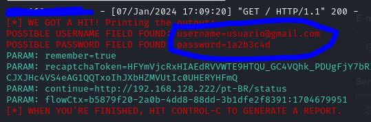

# Phishing para captura de senhas do Spotify

### Ferramentas

- Kali Linux
- setoolkit

### Configurando o Phishing no Kali Linux

- Acesso root: ``` sudo su ```
- Obtendo o endereço da máquina: ``` ifconfig ```
- Iniciando o setoolkit: ``` setoolkit ```

### Sequência do menu de opções
- Tipo de ataque: ``` (1) Social-Engineering Attacks ```
- Vetor de ataque: ``` (2) Web Site Attack Vectors ```
- Método de ataque: ``` (3) Credential Harvester Attack Method ```
- Método de ataque: ``` (2) Site Cloner ```
- Confirme o ip sugerido pelo setoolkit
- URL para clone: https://accounts.spotify.com/pt-BR/login

### Máquina hospedeira
- Acesse em seu navegador o ip sugerido pelo setoolkit
- Será exibido uma página clone da página de login do Spotify
- Entre com um login e senha

### Resultados - Setoolkit
